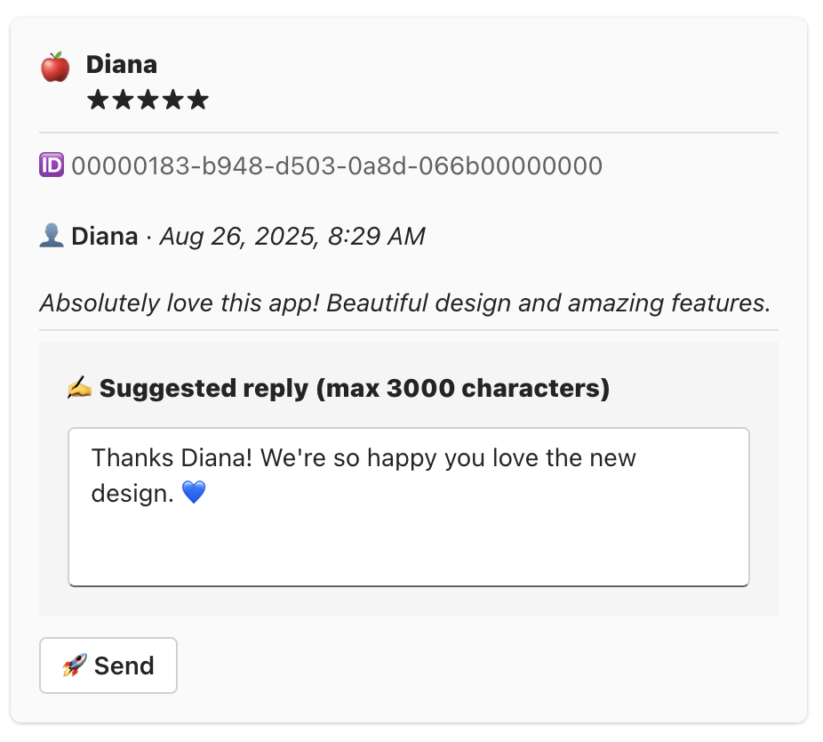
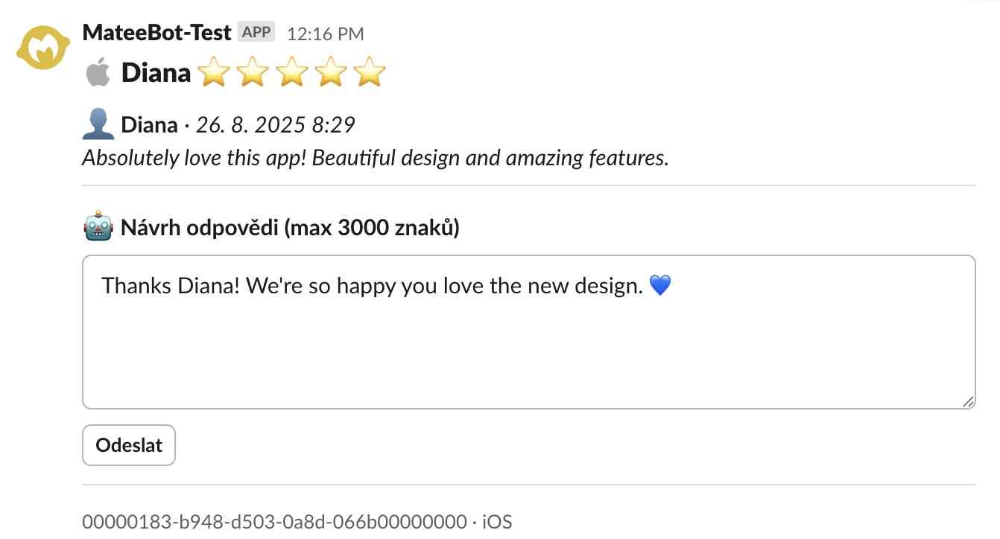

# Review Bot

Configure the bot to deliver your app reviews to Slack or Microsoft Teams — and reply directly from there.

  <table>
    <tr>
    <td align="center" valign="middle">
        
      </td>
      <td width="48"></td>
      <td align="center" valign="middle">
        
      </td>  
    </tr>
  </table>

Based on [self-hosted-n8n-template](https://github.com/brunosergi/self-hosted-n8n-template) with **Traefik** for simple deployment on your domain and **predefined n8n workflows** for the review bot.

## Getting Started

You can run this in two modes:

### 🔹 Managed (hosted by us)

- ✅ We handle setup, hosting, updates, maintenance
- ✅ Fastest path, no ops
- ❌ You must share access (API keys, etc.)
- ❌ Less flexibility for deep customization

**Use managed?** Send us your [App Definition](./App_Definition.md) and [Credentials](./Credentials.md). We’ll deploy and configure the stack for you.

### 🔹 Self-hosted

- ✅ Full control over infrastructure and data
- ✅ Customize anything
- ❌ You maintain it
- ❌ Some technical effort (Railway/Docker makes it easy)
- ❌ You pay hosting (usually small)

**Self-host steps (in this order):**

1. **Deploy the stack** → [Deployment.md](./Deployment.md)
   - Result: n8n + Traefik reachable at your public domain (e.g., `https://reviewbot.yourcompany.com`).
2. **Create your App Definition** → [App_Definition.md](./App_Definition.md)
   - Put your apps in a Google Sheet (field schema provided).
3. **Configure integrations** (Slack / Microsoft Teams)
   - Set up the Slack app or Teams bot in your workspace/tenant and collect IDs per the guide.
4. **Fill in credentials inside n8n** → [Credentials.md](./Credentials.md)
   - These are **n8n credentials** (OAuth/API keys/secrets) used by the workflows.
5. **Enable workflows** in n8n and set schedules/webhooks.

## Process Overview

1. Define apps → [App Definition](./App_Definition.md)
2. Deploy runtime → [Deployment](./Deployment.md)
3. Configure bots + paste **n8n credentials** → [Credentials](./Credentials.md)
4. Turn on workflows → reviews flow to Slack/Teams, replies go back to stores 🚀

## Documentation

- [Deployment.md](./Deployment.md) — Run stack with Traefik on your domain
- [App_Definition.md](./App_Definition.md) — Fields, examples, language, Teams/Slack IDs
- [Credentials.md](./Credentials.md) — All n8n credentials (Slack/Teams, Apple, Google)

## Notes

- If you don’t want to self-host, use **Managed**: send us `APP_DEFINITION` + `CREDENTIALS`.
- Self-host requires a public domain + TLS (Traefik handles certs in the template).
- Workflows ship preconfigured; you only map your **Google Sheet** and credentials.
 - Set `HMAC_SECRET` in `.env` (Slack webhook verification).
